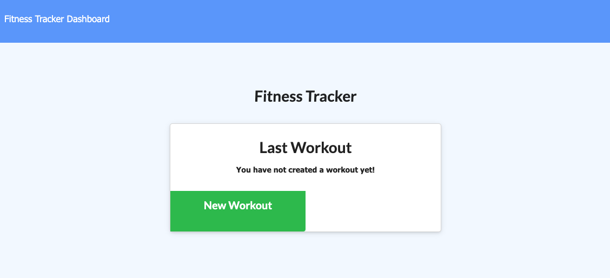
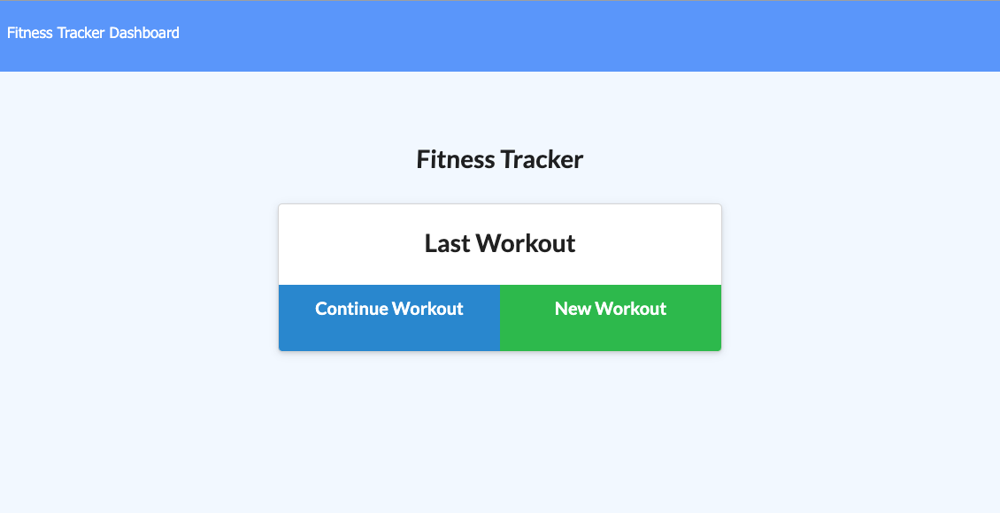
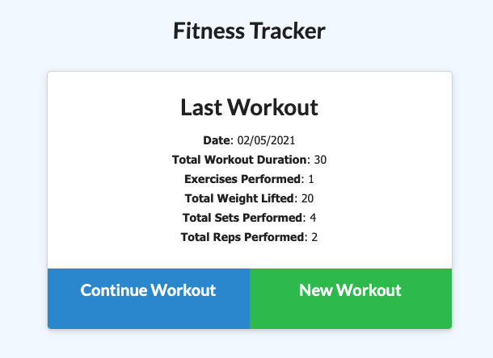
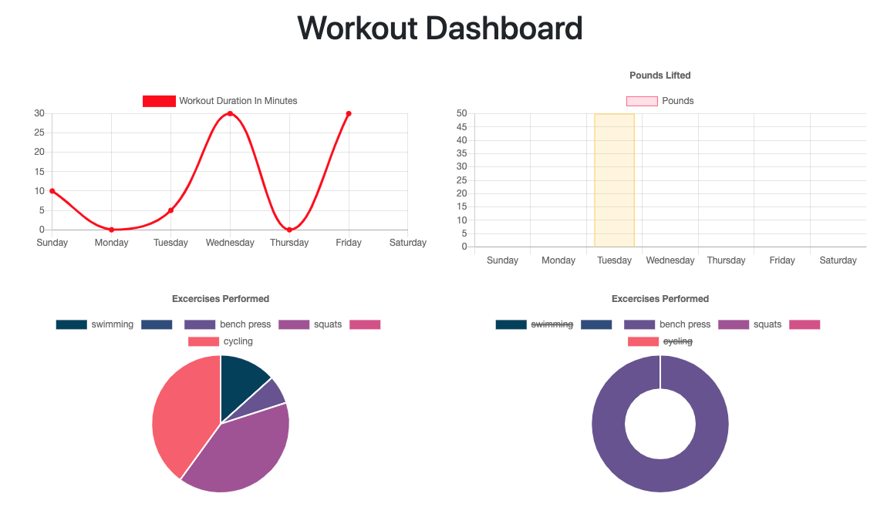

# FitnessTracker
This application is for users to tack their fitness journey. The dashboard will also display the summary of weights and minutes for the workouts.

[Fitness Tracker](https://shrouded-ravine-76853.herokuapp.com/)

## Installation
To get this application working, download the package and intall the dependencies needed. When everything is installed, its time to start the server by running node server.js or npm start.  If there are no errors it will establish the connection to the set port ('App running on port 3000!').  After this, the user can now visit http://localhost:3000/.

## Usage
[New User](public/assets/images/newuser.PNG) 

 
[Returning User](public/assets/images/homepage.PNG) 

 
[Last Workout](public/assets/images/last.PNG) 

 
[Dashboard](public/assets/images/dashboard.PNG) 

## Credits 
*[Mongodb / Mongo Atlas](https://www.mongodb.com/cloud/atlas/) 
*[Webpack.js.org](https://webpack.js.org/guides/progressive-web-application/) 
*[Express NPM Package](https://www.npmjs.com/package/express) 
